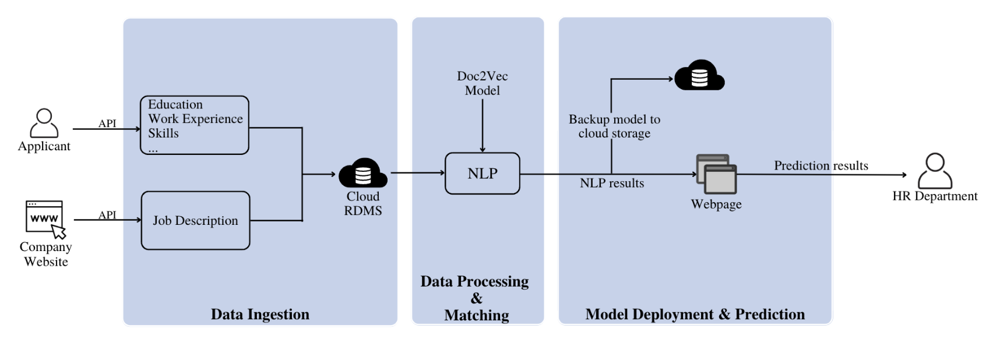
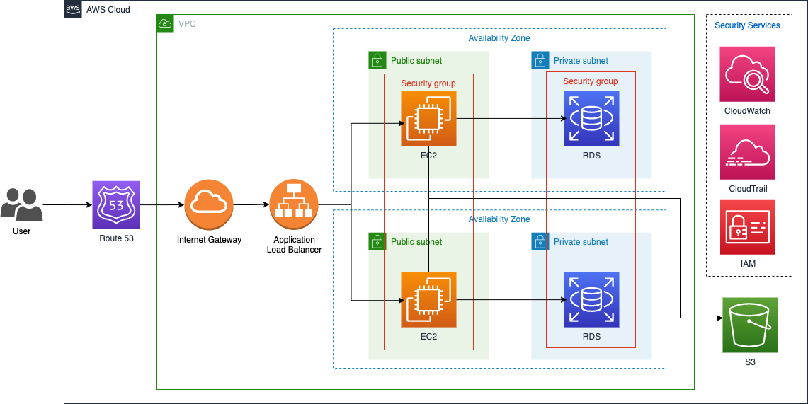

# TalentHunter 
## User Experience

## AWS System Design

As shown in the figure, we have designed the cloud architecture system that consists of various AWS services to handle user queries. Traffic is directed through an Application Load Balancer to EC2 instances sitting in two separate public subnets. These instances communicate with RDS located in private subnets and also connect to S3 for object storage. AWS security services such as CloudWatch, CloudTrail, and IAM are also implemented to ensure the system's security and reliability.

Following the high-level overview of architecture design, we will then deeper dive into functions of each component. User queries first enter AWS cloud platform via Route 53 which is a DNS web service that translates human-readable domain names into IP addresses of the Internet Gateway. The Application Load Balancer then distributes traffic across EC2 instances, enabling websites to handle high volumes of traffic without experiencing any downtime. While providing resizable compute capacity in cloud, the two EC2 instances are set up in two separate public subnets within two availability zones for greater fault tolerance. They then connect to S3 for storing large amounts of user data such as applicants’ resume files. Furthermore, the EC2 instances also communicate with RDS, a relational database service, that provides a fully-managed database environment where developers do not need to worry about database administration tasks such as backups and updates.

To deliver reliable and less corruptible services to users, the security modules must not be neglected. CloudWatch collects and analyses log data from EC2 instances, RDS, and ALB to deliver a unified view of the system's performance and detect any anomalies. Similarly, CloudTrail records all API calls made to identify any unauthorized access to AWS resources. IAM provides a centralized way to manage user permissions, ensuring that only authorized users are able to access sensitive data.